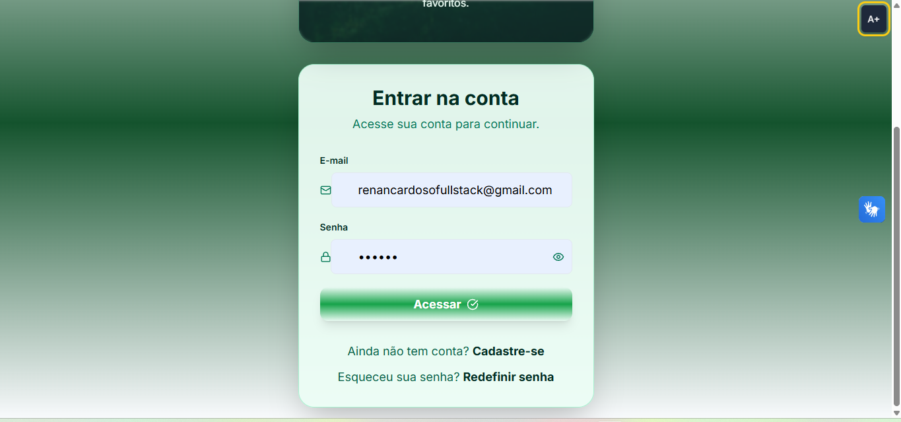
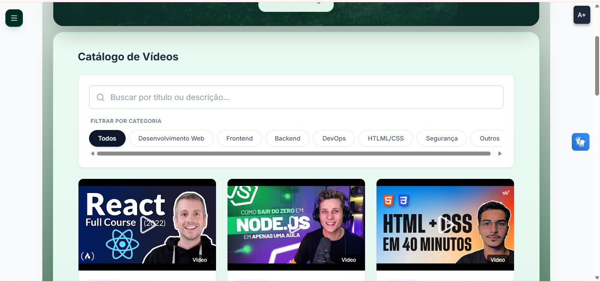
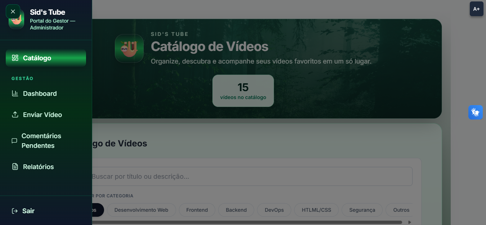
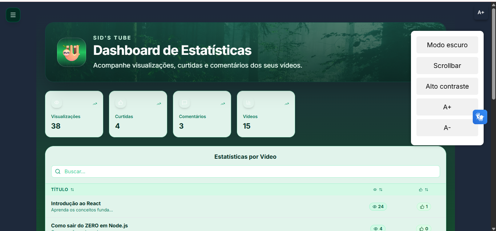
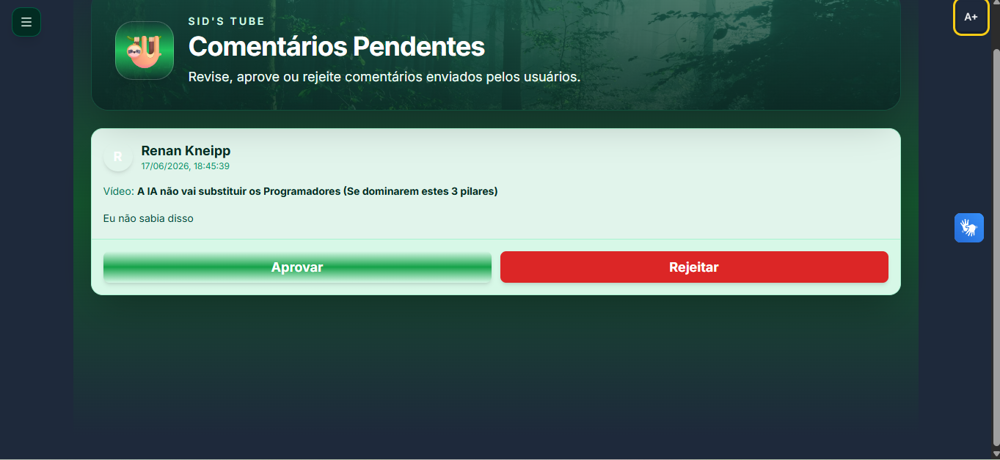
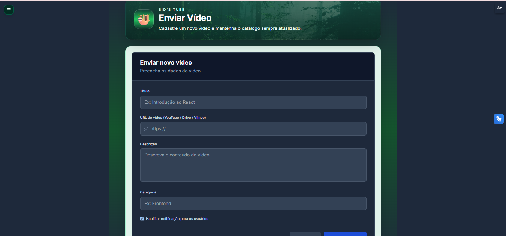
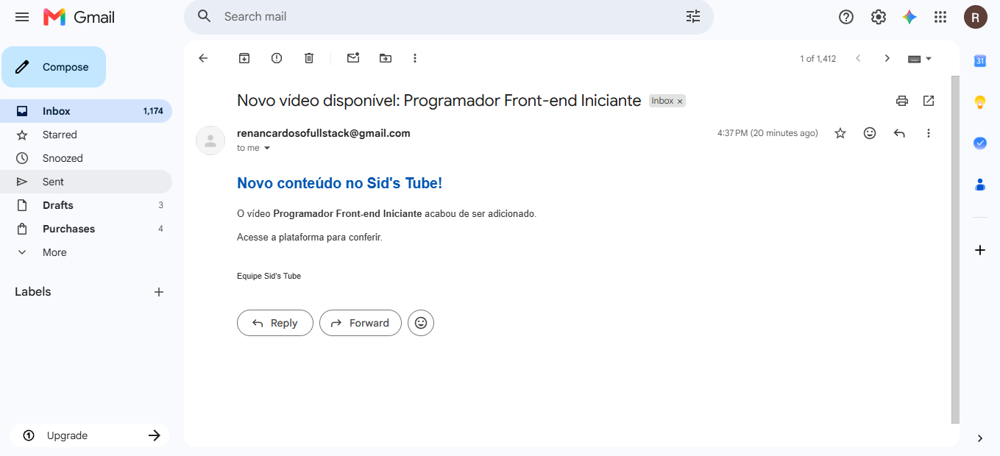
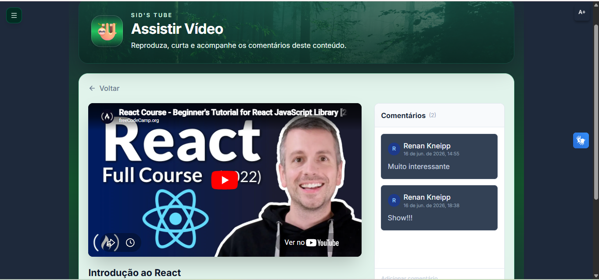

,
# 🎥 Sid's Tube


**Sid's Tube** é uma aplicação Full Stack para gerenciamento, consumo e análise de vídeos educacionais, desenvolvida com **React + TypeScript** no frontend e **Spring Boot + PostgreSQL** no backend.

O projeto conta com autenticação JWT, controle de perfis, catálogo de vídeos, comentários com aprovação, curtidas, histórico, dashboard administrativo, relatórios, recuperação de senha e notificações por e-mail via SMTP.

---

## 📌 Visão Geral

O Sid's Tube foi desenvolvido como uma plataforma completa, com foco em simular um ambiente real de streaming educacional e gestão de conteúdo.

A aplicação possui dois tipos principais de acesso:

- **Usuário:** acessa o catálogo, assiste vídeos, curte e comenta.
- **Gestor:** administra vídeos, acompanha métricas, aprova comentários e envia notificações por e-mail.

O projeto também recebeu uma identidade visual própria baseada em tons verdes, floresta e o mascote Sid 🦥.

---

## 📸 Demonstração

Coloque os prints dentro da pasta:

```txt
SidsTube-Prints-Portfolio
```

Use exatamente estes nomes para os arquivos:

```txt
01-login-sids-tube.png
02-catalogo-videos.png
03-menu-lateral.png
04-dashboard-estatisticas.png
05-comentarios-pendentes.png
06-enviar-video.png
07-email-notificacao.png
08-detalhe-video.png
```

### Tela de Login



### Catálogo de Vídeos



### Menu Lateral



### Dashboard de Estatísticas



### Comentários Pendentes



### Cadastro de Vídeos



### Notificação por E-mail



### Detalhe do Vídeo



---

## ✨ Funcionalidades

### 👤 Usuário

- Cadastro e login com autenticação JWT;
- Catálogo de vídeos;
- Busca por vídeos;
- Reprodução integrada;
- Curtidas;
- Comentários;
- Visualização de comentários aprovados;
- Histórico de vídeos assistidos;
- Recuperação de senha por e-mail.

### 👨‍💼 Gestor

- Dashboard administrativo;
- Cadastro de novos vídeos;
- Exclusão de vídeos;
- Aprovação e rejeição de comentários;
- Relatórios;
- Acompanhamento de métricas;
- Controle de permissões;
- Envio automático de notificações por e-mail.

### ♿ Acessibilidade

- Modo escuro;
- Alto contraste;
- Ajuste de tamanho da fonte;
- Menu de acessibilidade;
- Interface responsiva.

---

## 🛠️ Tecnologias Utilizadas

### Frontend

- React
- TypeScript
- Vite
- Axios
- React Router DOM
- Lucide React
- Tailwind CSS

### Backend

- Java
- Spring Boot
- Spring Security
- JWT
- Spring Data JPA
- Hibernate
- Jakarta Mail
- Maven

### Banco de Dados

- PostgreSQL

### Ferramentas

- Git
- GitHub
- VS Code
- pgAdmin
- GitHub Desktop

---

## 🧱 Arquitetura

```txt
Frontend React + TypeScript
          ↓
Axios / HTTP
          ↓
Spring Boot REST API
          ↓
Spring Security + JWT
          ↓
Services / Controllers / Repositories
          ↓
Spring Data JPA + Hibernate
          ↓
PostgreSQL
          ↓
SMTP Gmail para notificações
```

---

## 📁 Estrutura do Projeto

```txt
sids-tube/
│
├── sids-tube-backend/
│   ├── src/main/java/
│   │   └── com/serratec/alterdata/gitvideos/
│   │       ├── config/
│   │       ├── controller/
│   │       ├── dto/
│   │       ├── enums/
│   │       ├── model/
│   │       ├── repository/
│   │       ├── security/
│   │       └── service/
│   │
│   ├── src/main/resources/
│   └── pom.xml
│
├── sids-tube-frontend/
│   ├── src/
│   │   ├── components/
│   │   ├── contexts/
│   │   ├── pages/
│   │   ├── routes/
│   │   ├── services/
│   │   └── types/
│   │
│   ├── package.json
│   └── vite.config.ts
│
├── SidsTube-Prints-Portfolio/
│   └── imagens do projeto
│
├── README.md
└── .gitignore
```

---

## 🚀 Como Executar o Projeto

### Pré-requisitos

Antes de começar, instale:

- Java;
- Maven ou Maven Wrapper;
- Node.js;
- PostgreSQL;
- pgAdmin ou outro cliente PostgreSQL.

---

## 🔧 Backend

Entre na pasta do backend:

```bash
cd sids-tube-backend
```

Crie um banco PostgreSQL local chamado:

```sql
CREATE DATABASE sidstube;
```

Crie o arquivo:

```txt
src/main/resources/application-dev.properties
```

Use como base o arquivo:

```txt
src/main/resources/application-dev.example.properties
```

Exemplo:

```properties
spring.datasource.url=jdbc:postgresql://localhost:5432/sidstube
spring.datasource.username=postgres
spring.datasource.password=SUA_SENHA_AQUI

spring.jpa.hibernate.ddl-auto=update
spring.jpa.show-sql=true

app.frontend.host=http://localhost:5173
server.port=8001
app.backend.url=http://localhost:8001
```

Para configurar o envio de e-mails, use variáveis de ambiente ou configure localmente:

```properties
spring.mail.host=smtp.gmail.com
spring.mail.port=587
spring.mail.username=SEU_EMAIL
spring.mail.password=SUA_SENHA_DE_APP
spring.mail.properties.mail.smtp.auth=true
spring.mail.properties.mail.smtp.starttls.enable=true
```

Execute o backend:

```bash
./mvnw spring-boot:run
```

No Windows, também é possível usar:

```bash
mvnw.cmd spring-boot:run
```

Ou, se o Maven estiver instalado:

```bash
mvn spring-boot:run
```

A API ficará disponível em:

```txt
http://localhost:8001
```

---

## 💻 Frontend

Entre na pasta do frontend:

```bash
cd sids-tube-frontend
```

Instale as dependências:

```bash
npm install
```

Execute o projeto:

```bash
npm run dev
```

A aplicação ficará disponível em:

```txt
http://localhost:5173
```

---

## 🔐 Segurança

O projeto utiliza autenticação e autorização com:

- Spring Security;
- JWT;
- Filtro de autenticação;
- Filtro de autorização;
- Controle de rotas protegidas no frontend;
- Perfis de acesso para usuários e gestores.

### Perfis

#### Gestor

Acesso a:

- Dashboard;
- Envio de vídeos;
- Comentários pendentes;
- Relatórios;
- Área administrativa.

#### Usuário

Acesso a:

- Catálogo;
- Reprodução de vídeos;
- Curtidas;
- Histórico;
- Comentários.

---

## 📧 Notificações por E-mail

O Sid's Tube possui integração SMTP para envio de e-mails automáticos.

Fluxo:

```txt
Gestor cadastra um vídeo
        ↓
Vídeo é salvo no PostgreSQL
        ↓
Sistema verifica se a notificação está habilitada
        ↓
Usuários são identificados
        ↓
E-mails são enviados automaticamente
```

Também há fluxo de recuperação de senha por e-mail.

---

## 📊 Dashboard

O dashboard administrativo apresenta métricas gerais do catálogo, incluindo:

- Total de vídeos;
- Total de visualizações;
- Total de curtidas;
- Total de comentários;
- Estatísticas por vídeo;
- Busca e ordenação dos resultados.

---

## 💬 Moderação de Comentários

Comentários enviados pelos usuários passam por aprovação do gestor.

O gestor pode:

- Aprovar comentários;
- Rejeitar comentários;
- Visualizar usuário, vídeo e data do comentário.

---

## 🎨 Identidade Visual

A interface foi personalizada com:

- Tons verdes;
- Gradientes inspirados em floresta;
- Mascote Sid 🦥;
- Cards arredondados;
- Interface responsiva;
- Visual mais próximo de um produto real.

---

## 🧪 Desafios Resolvidos

Durante o desenvolvimento foram trabalhados problemas reais de uma aplicação Full Stack:

- Integração React com API Spring Boot;
- Configuração de CORS;
- Autenticação com JWT;
- Proteção de rotas;
- Conexão com PostgreSQL;
- Uso de SMTP Gmail;
- Senha de aplicativo Google;
- Recuperação de senha;
- Aprovação de comentários;
- Normalização de dados entre backend e frontend;
- Debug de erros HTTP;
- Organização do projeto para GitHub;
- Proteção de dados sensíveis no Git.

---

## 🔮 Melhorias Futuras

- Deploy em produção;
- Testes automatizados;
- Upload de arquivos de vídeo;
- Upload de thumbnails;
- Filtros avançados;
- Página pública de apresentação;
- Analytics mais detalhado;
- Notificações em tempo real;
- Melhorias de acessibilidade;
- Criação de uma logo própria em SVG.

---

## 👨‍💻 Autor

**Renan Melo de Oliveira Cardoso**

Desenvolvedor Full Stack em formação, com foco em React, JavaScript, TypeScript, Java, Spring Boot, PostgreSQL, APIs REST e automações.

📧 **E-mail:** renancardosofullstack@gmail.com  
🔗 **GitHub:** [renancardosofullstack](https://github.com/renancardosofullstack)

---

## ⭐ Observação

Este projeto foi desenvolvido como uma aplicação Full Stack completa, com foco em prática profissional, portfólio e simulação de demandas reais de desenvolvimento.
